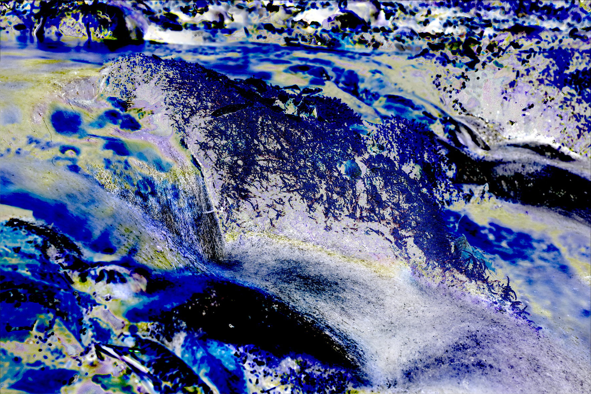

# Saltos binarios

## Rumbos en los mapas

Si la Sibila es una flecha y la investigación estudia un viaje ¿por qué no dibujar mapas?

Hace tiempo, momentos antes de aterrizar en Palma, vi un triángulo entre las montañas. Intuí que debía ir al centro pero que también era una flecha que apuntaba hacia algún lugar hacia el norte.

Usando la misma idea quise ver cómo se proyectaba una línea entre el Santuario de LLuc y el templo de la Sibila de Tívoli.

También está el "pin" en Eritrea (actual Ildırı, Turquía).

Sin conclusiones pero seguiré experimentando. La proyección del rumbo no acaba de funcionar bien.

## Análisis estadístico de imágenes

Imagen de referencia

Stack de 7 imágenes con variaciones de exposición. [Skewness](https://en.wikipedia.org/wiki/Skewness) o [asimetría estadística](https://es.wikipedia.org/wiki/Asimetr%C3%ADa_estad%C3%ADstica).

Las mismas imágenes combinadas con diferentes operaciones.

## Conversaciones con chatGPT

Durante todo el proceso he utilizado chatGPT para buscar información, que luego tenía que contrastar 
con más búsquedas normales en la web y dirigirlas a fuentes de confianza.

Una de las pruebas fue pedirle a chatGPT que interpretara algunos dibujos. El resultado fue sorprendente. 
Conseguía hacer preguntas que me costaba responder.

La conversación [se puede leer aquí](/posts/chatGPT/2024-10-21/).