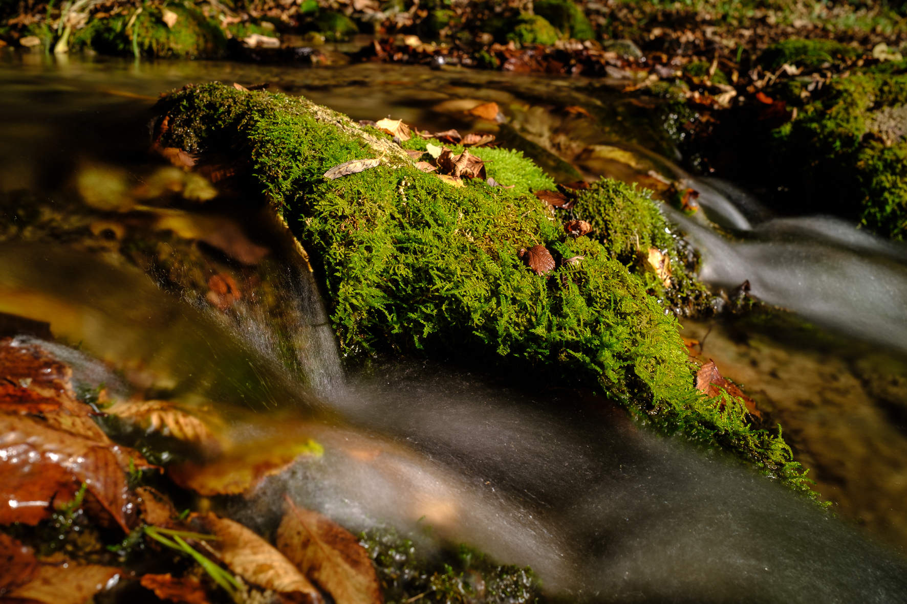

# Salti binari

## Rotte sulle mappe

Se la Sibilla è una freccia, perché non disegnare una mappa?

Un po' di tempo fa, poco prima di atterrare a Palma, ho visto un triangolo tra le montagne. Ho intuito che dovevo andare
al centro, ma era anche una freccia che puntava verso un luogo.

Usando la stessa idea, ho voluto vedere come si proiettava una linea tra il Santuario di Lluc e il tempio della Sibilla
di Tivoli.

Per risparmiare tempo, ho usato chatGPT per creare un programma in Python che tracciasse i disegni in formato KML per
vederli su Google Earth.

C'è anche il "pin" in Eritrea (l'attuale Ildırı, in Turchia).

Nessuna conclusione sul percorso, ma continuerò a sperimentare. Il codice di chatGPT non funziona molto bene quando i
due punti che creano il percorso sono lontani.

## Análisis statistico delle immagini

Immagine di riferimento

Stack di 7 immagini con variazioni di esposizione. [Asimmetria statistica](https://it.wikipedia.org/wiki/Simmetria_(statistica)) o [Skewness](https://en.wikipedia.org/wiki/Skewness).

Le stesse immagini combinate con diverse operazioni.

## Conversazioni con chatGPT

Durante tutto il processo ho utilizzato chatGPT per cercare informazioni, che poi dovevo verificare 
con ulteriori ricerche normali sul web e indirizzarle verso fonti di fiducia.

Una delle prove è stata chiedere a chatGPT di interpretare alcuni disegni. Il risultato è stato sorprendente."
Riusciva a fare domande che mi erano difficili da rispondere.

La conversazione [può essere letta qui](/posts/chatGPT/2024-10-21/).

> Tradotto in italiano da chatGPT

