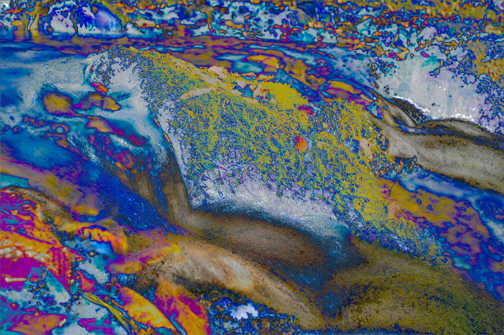

# Binary Jumps

## Directions on the Maps

If the Sibyl is an arrow and the research explores a journey, why not draw maps?

Some time ago, just before landing in Palma, I saw a triangle among the mountains. I sensed I had to go to its center but also that it was an arrow pointing somewhere to the north.

Using the same idea, I wanted to see how a line would project between the Sanctuary of Lluc and the Sibyl Temple in Tivoli.

There’s also the "pin" in Eritrea (present-day Ildırı, Turkey).

No conclusions yet, but I’ll keep experimenting. The direction’s projection isn’t working quite right.

## Statistical Analysis of Images

Reference image

Stack of 7 images with exposure variations. [Skewness](https://en.wikipedia.org/wiki/Skewness) or [statistical asymmetry](https://en.wikipedia.org/wiki/Skewness).

The same images combined with different operations.

## Conversations with chatGPT

Throughout the process, I used chatGPT to gather information, which I then had to cross-check with further web searches and direct to reliable sources.

One of the tests involved asking chatGPT to interpret some drawings. The result was surprising. 
It managed to ask questions I found hard to answer.

The conversation [can be read here](/posts/chatGPT/2024-10-21/).
