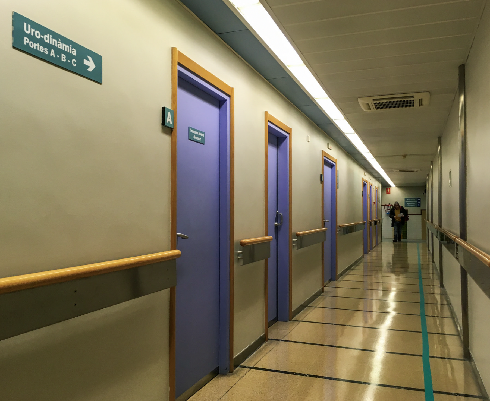

# El viaje en clave mística

El viaje más largo está frente al espejo.

## ¿Cuándo empezó este viaje?

Al empezar la recopilación de fotografías e información para esta web, me hice la pregunta: ¿Cuándo empezó este viaje?

¿El día que recibí la invitación, o tal vez cuando aquella frase —a veces nos quitan el suelo de debajo de los pies para
que descubramos que ya sabíamos volar— regresó una y otra vez a mi mente? ¿O fue durante la sesión
de [Juan Manuel Giordano](https://www.juanmanuelgiordano.com/), cuando dirigí mi intención a encontrar _claridad, fuerza,
coraje, amor y ecuanimidad_? ¿Fue el 7 de febrero cuando, en una sesión de biodinámica, puse como intención "abrirme al amor"? ¿Cuando escribí _[solo camina](https://susurros.fransimo.info/posts/2023/10/nueva_ribadesella/)_ después de hacer 400 km
del Camino de Santiago? ¿O fue un año y medio antes, cuando decidí formarme en masaje tántrico? Un proceso que me llevaría a sentir,
primero "ya no sé quién soy", y poco después "ya no sé nada". ¿O el 10 de enero del 2017, aquel día que temblaba de fiebre en un hospital, haciendo trámites y que no podía dejar de
regresar a mis 15 años?

Ese día, mi cuerpo gritaba "quiero vivir", la fiebre era la vida abriéndose camino. Alguien me dijo algo como: ciertos
paisajes te transportan en el tiempo y en tus traumas. Ese día mi vida empezó a cambiar.

¿Y por qué tantas preguntas? Porque de eso está hecho el camino. A veces la gente me dice cosas como "eres
valiente"... la verdad es que no sé qué es eso. Un maestro me dijo una vez: 'tú ya no tienes opción; si no sigues la llamada, enfermarás'. Y quizá tenía razón. He
pasado años tratando de afinar mi intuición, de escuchar mejor esos susurros. Ahora que lo consigo, no me queda más
remedio que seguirlos, aunque no los entienda.

## ¿Cómo viajar?

¿Y cómo emprender un viaje así? _Con la maleta más pequeña_, soltando... dejando atrás todo lo que no te acompaña. Esta vez eso implicó dejar un trabajo estable, una casa y una relación. Escuchando el silencio, reconociendo a los guías.

## ¿A dónde vas?

Todos hemos escuchado: 'Caminante no hay camino, se hace camino al andar'. Sin embargo, creo que sí hay un destino, un lugar al que ir. Uno para cada uno de nosotros en cada momento porque cuando llegas aparece otro. Nuestra libertad es la de
escoger cómo llegar ahí, es decir, no hay camino, pero sí destino. Uno que se transforma con el tiempo.

Puedes dar muchas vueltas para llegar, puedes incluso decidir no ir, pero eso tiene un costo. No ir implica que te
pierdes el misterio que desvelaría ese lugar.

El lugar puede ser físico o no. El viaje no implica un desplazamiento, pero sí tiene una consecuencia.  
Al volver, si vuelves, ya no eres el mismo. Quieras o no, ir a ese lugar que deseas o del que te escondes
te transforma, y viajar allí tiende a ser inevitable. "Resistirse es fútil" ;-)

De pequeño solía decir "lo mejor de viajar es volver". Pero, si viajas, nunca vuelves, ni eres el mismo, ni ves a tu
lugar igual. De niño no lo hubiera sabido explicar, pero lo entendía. Viajar ejercita el "ver con nuevos ojos".

Mi búsqueda es la búsqueda de Dios. No el Dios de la iglesia. Para mí, Dios está dentro de mí, en ti y en todo, porque
somos uno, siempre, y todo lo demás es ilusión. Es una verdad que está dentro de mí desde que tengo memoria, pero aún no
es una vivencia. Algo así como saber, sin lugar a dudas, que las llaves están en la habitación y no encontrarlas.

Es una búsqueda que vuelve a casa. Porque al final, el viaje más largo siempre está frente al espejo.
