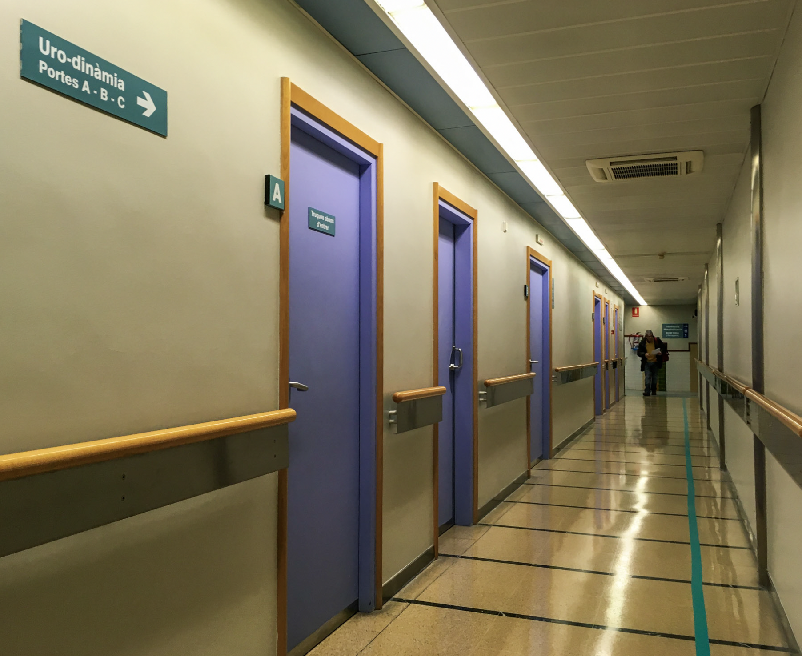

# Il viaggio in chiave mistica

Il viaggio più lungo è davanti allo specchio.

## Quando è iniziato questo viaggio?

Iniziando la raccolta di fotografie e informazioni per questo sito, mi sono posto la domanda: quando è iniziato questo viaggio?  

È stato il giorno in cui ho ricevuto l'invito, o forse quando quella frase —a volte ci tolgono il terreno sotto i piedi affinché scopriamo che sappiamo già volare— è tornata e tornata ancora nella mia mente? Oppure durante la sessione con [Juan Manuel Giordano](https://www.juanmanuelgiordano.com/), quando ho diretto la mia intenzione a trovare _chiarezza, forza, coraggio, amore ed equanimità_? È stato il 7 febbraio, quando in una sessione di biodinamica ho posto come intenzione "aprirsi all'amore"? O forse quando ho scritto _[solo cammina](https://susurros.fransimo.info/posts/2023/10/nueva_ribadesella/)_ dopo aver percorso 400 km del Cammino di Santiago? O un anno e mezzo prima, quando ho deciso di formarmi nel massaggio tantrico? Un processo che mi avrebbe portato prima a sentire "non so più chi sono" e poco dopo "non so più nulla". Oppure il 10 gennaio 2017, quel giorno in cui tremavo di febbre in un ospedale, sbrigando pratiche burocratiche, incapace di smettere di tornare ai miei 15 anni?  

Quel giorno il mio corpo gridava "voglio vivere", la febbre era la vita che si faceva strada. Qualcuno mi disse qualcosa come: certi paesaggi ti trasportano nel tempo e nei tuoi traumi. Quel giorno la mia vita iniziò a cambiare.  

E perché tante domande? Perché è così che è fatto il cammino. A volte la gente mi dice cose come "sei coraggioso"... la verità è che non so cosa significhi davvero. Un maestro una volta mi disse: "Non hai più scelta; se non segui la chiamata, ti ammalerai." E forse aveva ragione. Ho passato anni cercando di affinare la mia intuizione, di ascoltare meglio quei sussurri. Ora che ci riesco, non mi resta altra scelta che seguirli, anche se non li comprendo.  

## Come viaggiare?

E come intraprendere un viaggio simile? _Con la valigia più piccola_, lasciando andare... lasciandosi alle spalle tutto ciò che non ti accompagna. Questa volta significava lasciare un lavoro stabile, una casa e una relazione. Ascoltare il silenzio, riconoscere le guide.  

## Dove stai andando?

Tutti abbiamo sentito: "Caminante, no hay camino, se hace camino al andar" (Viandante, non c'è cammino, il cammino si fa andando). Tuttavia, credo che una destinazione esista, un luogo verso cui andare. Uno per ognuno di noi in ogni momento, perché quando arrivi, ne appare un altro. La nostra libertà è scegliere come arrivarci, ossia, non c'è un cammino, ma c'è una meta. Una meta che si trasforma con il tempo.  

Puoi fare molti giri per arrivarci, puoi persino decidere di non andarci, ma ha un costo. Non andare significa perdersi il mistero che quel luogo svelerebbe.  

Il luogo può essere fisico o no. Il viaggio non implica uno spostamento, ma ha una conseguenza.  
Quando torni, se torni, non sei più lo stesso. Che tu lo voglia o no, andare in quel luogo che desideri o da cui ti nascondi ti trasforma, e viaggiare lì tende a essere inevitabile. "Resistere è inutile" ;-)

Da piccolo dicevo spesso: "la cosa migliore del viaggiare è tornare". Ma, se viaggi, non torni mai, né sei più lo stesso, né vedi il tuo luogo nello stesso modo. Da bambino non avrei saputo spiegarlo, ma lo capivo. Viaggiare esercita il "vedere con occhi nuovi".  

La mia ricerca è la ricerca di Dio. Non il Dio della chiesa. Per me, Dio è dentro di me, in te e in tutto, perché siamo uno, sempre, e tutto il resto è illusione. È una verità che è dentro di me da quando ho memoria, ma non è ancora un'esperienza vissuta. Qualcosa come sapere, senza alcun dubbio, che le chiavi sono nella stanza, ma non riuscire a trovarle.  

È una ricerca che torna a casa. Perché, alla fine, il viaggio più lungo è sempre davanti allo specchio.  
