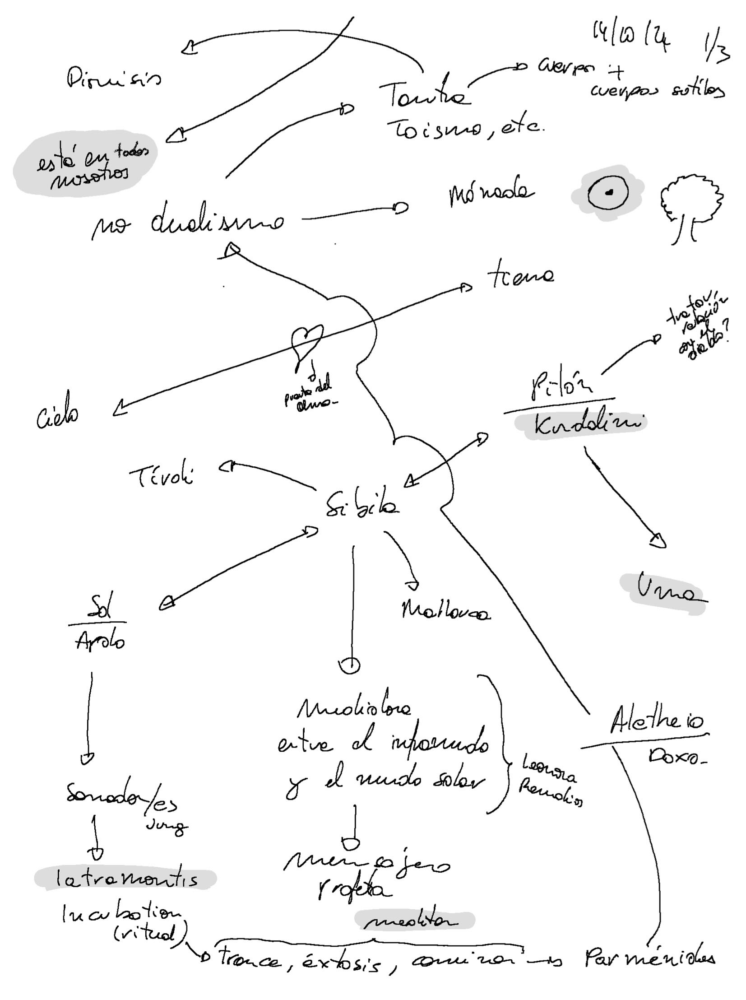

# Contexto

Este documento resume el estado de la investigación sobre _arte y magia_ realizada en el marco 
de una residencia en Civitella di Licenza, Roma, Italia, desde el 16 de septiembre del 2024 al 17 de enero del 2025 
parte del programa [Residency action de Culture Moves Europe](https://culture.ec.europa.eu/creative-europe/creative-europe-culture-strand/culture-moves-europe).

# Declaración al inicio de la primera parte

Mi investigación artística explora la relación entre el arte y la magia, con la Sibila como nexo entre Mallorca, Tívoli y los flujos de agua (ninfas y náyades). Investigo figuras de sanación pre-hipocrática y chamánica, así como artistas 'medium' como Hilma af Klint, Leonora Carrington y Remedios Varo.

Mi práctica personal conecta lo conceptual con lo físico a través de caminatas meditativas en la naturaleza, técnicas de masaje y sanación, rituales de devoción y la canalización, influenciada por tradiciones como la cherokee (Tameana). Esta investigación se basa en una práctica real de sanación.

La obra que emerja de este proceso evocará la sanación del alma, su reflejo en el cuerpo, la tradición mágica europea y sus conexiones con las tradiciones orientales y americanas, intentando probar la hipótesis de que esta sabiduría y poder son inherentes a todos los seres humanos.

___

# Experimentación

En mi camino hay una constante, cada día sé menos y experimento más. Hasta ahora, la vía para saber menos es aprender más. Aprender más desde el cuerpo, la mente, la intuición y la meditación.

"Todo ocurre en el cuerpo".

## Metodología

- Meditación
	- Hacia la quietud dinámica (en términos biodinámica craneosacral) 
	- Conversaciones con los árboles:
		- Entrar en contacto (físico y campo) en estado de quietud.
		- Formular preguntas.
	- Las respuestas son imágenes.
	- Dibujo automático.
	- Fotografía (guiada por los árboles, meditativa, intuitiva). 
    - Caminar.
- Lectura.
- Saltos "binarios"
	- Discusiones con chatGPT
	- Sobre las interpretaciones que hace de lo que dibujo 2024-10-21 Dibujos chatGPT
	- Código para dibujar en los mapas los rumbos. 
	- Tratamiento estadísticos de las imágenes de las ninfas.
- Integración y sistematización Organización de notas
	- Obsidian Mapas mentales

## Mapa de la investigación

## Sibila

La Sibila tiene su sección propia [aquí](/docs/sibyl).

## Conversaciones con los árboles

En [Pequeña guía para hablar con los árboles](/docs/talking_with_the_trees) y otros seres se explica el 
proceso para entrar en meditación y comunicación con la red de vida del bosque.

[Aquí se detallan las sesiones](/es/tags/hablando-con-los-árboles/).

## El Susurro de las Ninfas (lo pequeño contiene un universo)

El Susurro de las Ninfas tiene [su propia sección aquí](/docs/sanctuary).

## Saltos binarios

### Rumbos en los mapas

Si la Sibila es una flecha y la investigación estudia un viaje ¿por qué no dibujar mapas?

Hace tiempo, momentos antes de aterrizar en Palma, vi un triángulo entre las montañas. Intuí que debía ir al centro pero que también era una flecha que apuntaba hacia algún lugar hacia el norte.

Usando la misma idea quise ver cómo se proyectaba una línea entre el Santuario de LLuc y el templo de la Sibila de Tívoli.

También está el "pin" en Eritrea (actual Ildırı, Turquía).

Sin conclusiones pero seguiré experimentando. La proyección del rumbo no acaba de funcionar bien.

### Análisis estadístico de imágenes

Imagen de referencia

Stack de 7 imágenes con variaciones de exposición. [Skewness](https://en.wikipedia.org/wiki/Skewness) o [asimetría estadística](https://es.wikipedia.org/wiki/Asimetr%C3%ADa_estad%C3%ADstica).

Las mismas imágenes combinadas con diferentes operaciones.

## Firma, círculo, identidad

La visión en la primera conversación con el árbol fue una mujer en la cama en intimidad, sin rostro. La mirada se enfoca al ombligo. Lo vinculé con el Ónfalo como obligo y representado con un círculo con un punto dentro. Ese día, más tarde lo relacioné con la Monada, Pau e Ilaria.

El 13 de noviembre veo también la relación con mis firmas y mis logos. Ambas firmas tienen un círculo principal y un punto en el exterior abajo a la derecha. Los logos ya llevan el punto en el centro.

Nota: [Pau Lluc](https://pau-lluc.xyz/) es mi seudónimo de masajista.

| Fran Simó - Legal | Fran Simó - vagabundo | Pau Lluc         | Unity Labs                  |
| ----------------- | --------------------- | ---------------- | --------------------------- |
|  |      |  |  |

## Dibujos automáticos

Los dibujos automáticos tienen [su propia sección aquí](/docs/drawing).

# Libros

## Leyendo

- En los oscuros lugares del saber, Peter Kingsley
- Psicomagia, Alejandro Jodorowsky
- Voices of our Ancestors, Dhyani Ywahoo

## Por leer

- Física y metafísica de la pintura, Louis Cattiaux
- Androginia, Elémire Zolla
- Seguir con el problema. Generar parentesco en el Chthuluceno, Donna J. Haraway

# Artistas

- Hilma af Klint
- Leonora Carrignton
- Remedios Varo
- Louis Cattiaux
- Emma Kunz
- Mikalojus Konstantinas Čiurlionis
- Mapi Rivera
- Maria Arnal

Pendiente: Agregar nuevos / actuales... ver documentación Mapi

# Siguientes pasos

Esta investigación es un viaje. La residencia ha supuesto dejar mi trabajo y mi casa para intentar una nueva forma de vida. Estos 4 primeros meses en Italia son solo el primer paso. Mi intención es poder continuar investigando y dando forma artística, ritual, canalizadora y sanadora a este proceso.

## Mapa 

He reunido todas las “pistas” en un mapa. Creo que la investigación tiene que seguir en movimiento. Leer es importante, pero para entender creo que he de caminar por aquellos lugares donde la tradición vivió.

En la [web](https://www.google.com/maps/d/edit?mid=1N9lbW-JlA8tJtXUqbPD6LnPmdEML85I&usp=sharing)

- Puntos amarillos: son templos o posibles lugares de culto u origen de las sibilas más conocidas.
- Puntos violetas: lugares mencionados en el libro En los oscuros lugares del saber.
- Puntos grises: lugares relacionados con el culto a Dionisio o que la intuición me ha marcado como destino.

## Preguntas abiertas

¿Cómo conectar en la obra todas las partes: fotografía, informática (new media) y magia?

Si ¿“El arte es mágico o no es.”? La exposición como un ritual? Cómo convertir una obra en mágica... ? Cuánta fuerza ha de tener para transportarte sin artificios. 

