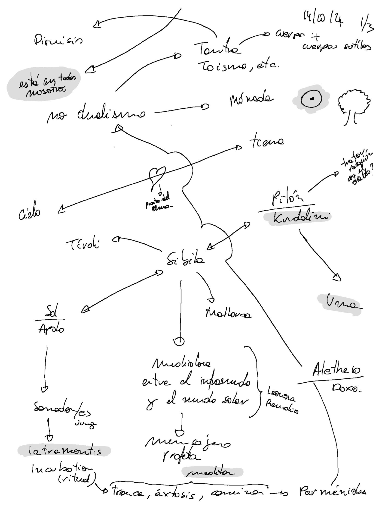

# Contesto

Questo documento riassume lo stato della ricerca su arte e magia realizzata nell'ambito di una 
residenza a Civitella di Licenza, Roma, Italia, dal 16 settembre 2024 al 17 gennaio 2025, parte del 
programma [Residency action de Culture Moves Europe](https://culture.ec.europa.eu/creative-europe/creative-europe-culture-strand/culture-moves-europe).

# Dichiarazione all'inizio della prima parte

La mia ricerca artistica esplora la relazione tra arte e magia, con la Sibilla come connessione tra Maiorca, Tivoli e i flussi d'acqua (ninfe e naiadi). Indago figure di guarigione pre-ippocratica e sciamanica, così come artisti "medium" come Hilma af Klint, Leonora Carrington e Remedios Varo.

La mia pratica personale collega il concettuale al fisico attraverso camminate meditative nella natura, tecniche di massaggio e guarigione, rituali di devozione e canalizzazione, influenzata da tradizioni come quella cherokee (Tameana). Questa ricerca si basa su una pratica reale di guarigione.

L'opera che emergerà da questo processo evocherà la guarigione dell'anima, il suo riflesso nel corpo, la tradizione magica europea e le sue connessioni con le tradizioni orientali e americane, cercando di dimostrare l'ipotesi che questa saggezza e potere siano intrinseci a tutti gli esseri umani.

5 parole chiave:
- Arte e magia 
- Sibilla 
- Guarigione ancestrale 
- Artisti medium 
- Natura e meditazione

# Sperimentazione

Nel mio percorso c’è una costante: ogni giorno so di meno ed esperimento di più. Finora, la via per sapere di meno è imparare di più. Imparare di più attraverso il corpo, la mente, l’intuizione e la meditazione.

"Tutto accade nel corpo."

## Metodologia

- Meditazione
	- Verso la quiete dinamica (in termini di biodinamica craniosacrale).
	- Conversazioni con gli alberi:
		- Entrare in contatto (fisico e attraverso il campo) in uno stato di quiete.
		- Formulare domande.
        - Le risposte arrivano sotto forma di immagini.
	- Disegno automatico
	- Fotografia (Guidata dagli alberi, meditativa, intuitiva.). 
    - Camminare.
- Lettura.
- Salti "binari"
	- Discussioni con ChatGPT
	- Interpretazioni dei miei disegni [(es. 2024-10-21: Disegni e ChatGPT)](/posts/chatGPT/2024-10-21/).
	- Codice per tracciare sui mappe i percorsi e le direzioni.
	- Analisi statistica. Trattamento delle immagini delle ninfe.
- Integrazione e sistematizzazione
	- Organizzazione delle note (Obsidian). 
    - Mappe mentali.

## Mappa della ricerca

## Sibilla

La Sibilla ha la sua sezione dedicata [qui](/docs/sibyl).

## Conversazioni con gli alberi

Nella [Piccola guida per parlare con gli alberi](/docs/talking_with_the_trees) e altri esseri si spiega il processo per entrare in meditazione e comunicazione con la rete di vita del bosco.

[Qui vengono dettagliate le sessioni](/it/tags/Conversazioni-con-gli-alberi/).

## Il Sussurro delle Ninfe (il piccolo contiene un universo)

Il Sussurro delle Ninfe ha [la sua sezione dedicata qui](/docs/sanctuary).

## Salti binari

I salti binari hanno [la loro sezione qui](/docs/binary_links).

## Disegni automatici

I disegni automatici hanno [la loro sezione dedicata qui](/docs/drawing).

# Libros

## Leyendo

- En los oscuros lugares del saber, Peter Kingsley
- Psicomagia, Alejandro Jodorowsky
- Voices of our Ancestors, Dhyani Ywahoo

## Por leer

- Física y metafísica de la pintura, Louis Cattiaux
- Androginia, Elémire Zolla
- Seguir con el problema. Generar parentesco en el Chthuluceno, Donna J. Haraway

# Artistas

- Hilma af Klint
- Leonora Carrignton
- Remedios Varo
- Louis Cattiaux
- Emma Kunz
- Mikalojus Konstantinas Čiurlionis
- Mapi Rivera
- Maria Arnal

Pendiente: Agregar nuevos / actuales... ver documentación Mapi

# Siguientes pasos

Esta investigación es un viaje. La residencia ha supuesto dejar mi trabajo y mi casa para intentar una 
nueva forma de vida. Estos 4 primeros meses en Italia son solo el primer paso. Mi intención es poder continuar 
investigando y dando forma artística, ritual, canalizadora y sanadora a este proceso.

## Mapa 

He reunido todas las “pistas” en un mapa. Creo que la investigación tiene que seguir en movimiento. 
Leer es importante, pero para entender creo que he de caminar por aquellos lugares donde la tradición vivió.

En la [web](https://www.google.com/maps/d/edit?mid=1N9lbW-JlA8tJtXUqbPD6LnPmdEML85I&usp=sharing)

- Puntos amarillos: son templos o posibles lugares de culto u origen de las sibilas más conocidas.
- Puntos violetas: lugares mencionados en el libro En los oscuros lugares del saber.
- Puntos grises: lugares relacionados con el culto a Dionisio o que la intuición me ha marcado como destino.

