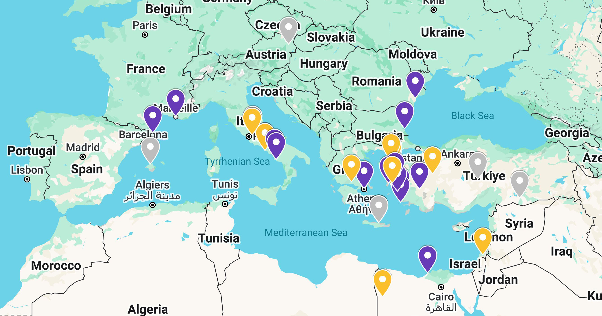

# Contexto

Este documento resume el estado de la investigación sobre _arte y magia_ realizada en el marco 
de una residencia en Civitella di Licenza, Roma, Italia, desde el 16 de septiembre del 2024 al 17 de enero del 2025 
parte del programa [Residency action de Culture Moves Europe](https://culture.ec.europa.eu/creative-europe/creative-europe-culture-strand/culture-moves-europe).

# Declaración al inicio de la primera parte

Mi investigación artística explora la relación entre el arte y la magia, con la Sibila como nexo entre Mallorca, Tívoli y los flujos de agua (ninfas y náyades). Investigo figuras de sanación pre-hipocrática y chamánica, así como artistas 'medium' como Hilma af Klint, Leonora Carrington y Remedios Varo.

Mi práctica personal conecta lo conceptual con lo físico a través de caminatas meditativas en la naturaleza, técnicas de masaje y sanación, rituales de devoción y la canalización, influenciada por tradiciones como la cherokee (Tameana). Esta investigación se basa en una práctica real de sanación.

La obra que emerja de este proceso evocará la sanación del alma, su reflejo en el cuerpo, la tradición mágica europea y sus conexiones con las tradiciones orientales y americanas, intentando probar la hipótesis de que esta sabiduría y poder son inherentes a todos los seres humanos.

___

# Experimentación

En mi camino hay una constante, cada día sé menos y experimento más. Hasta ahora, la vía para saber menos es aprender más. Aprender más desde el cuerpo, la mente, la intuición y la meditación.

"Todo ocurre en el cuerpo".

## Metodología

- Meditación
	- Hacia la quietud dinámica (en términos biodinámica craneosacral) 
	- Conversaciones con los árboles:
		- Entrar en contacto (físico y campo) en estado de quietud.
		- Formular preguntas. 
        - Las respuestas son imágenes.
	- Dibujo automático.
	- Fotografía (guiada por los árboles, meditativa, intuitiva). 
    - Caminar.
- Lectura.
- Saltos "binarios"
	- Discusiones con chatGPT
	- Sobre las interpretaciones que hace de lo que dibujo [2024-10-21 Dibujos chatGPT](/posts/chatGPT/2024-10-21/)
	- Código para dibujar en los mapas los rumbos. 
	- Tratamiento estadísticos de las imágenes de las ninfas.
- Integración y sistematización Organización de notas
	- Obsidian Mapas mentales

## Mapa de la investigación

## Sibila

La Sibila tiene su sección propia [aquí](/docs/sibyl).

## Conversaciones con los árboles

En [Pequeña guía para hablar con los árboles](/docs/talking_with_the_trees) y otros seres se explica el 
proceso para entrar en meditación y comunicación con la red de vida del bosque.

[Aquí se detallan las sesiones](/es/tags/hablando-con-los-árboles/).

## El Susurro de las Ninfas (lo pequeño contiene un universo)

El Susurro de las Ninfas tiene [su propia sección aquí](/docs/sanctuary).

## Saltos binarios

los saltos binarios tienen [su sección aquí](/docs/binary_links).

## Dibujos automáticos

Los dibujos automáticos tienen [su propia sección aquí](/docs/drawing).

# Libros

## Leyendo

- En los oscuros lugares del saber, Peter Kingsley
- Psicomagia, Alejandro Jodorowsky
- Voices of our Ancestors, Dhyani Ywahoo

## Por leer

- Física y metafísica de la pintura, Louis Cattiaux
- Androginia, Elémire Zolla
- Seguir con el problema. Generar parentesco en el Chthuluceno, Donna J. Haraway

# Artistas

- Hilma af Klint
- Leonora Carrignton
- Remedios Varo
- Louis Cattiaux
- Emma Kunz
- Mikalojus Konstantinas Čiurlionis
- Mapi Rivera
- Maria Arnal

Pendiente: Agregar nuevos / actuales... ver documentación Mapi

# Siguientes pasos

Esta investigación es un viaje. La residencia ha supuesto dejar mi trabajo y mi casa para intentar una 
nueva forma de vida. Estos 4 primeros meses en Italia son solo el primer paso. Mi intención es poder continuar 
investigando y dando forma artística, ritual, canalizadora y sanadora a este proceso.

## Mapa 

He reunido todas las “pistas” en un mapa. Creo que la investigación tiene que seguir en movimiento. 
Leer es importante, pero para entender creo que he de caminar por aquellos lugares donde la tradición vivió.

En la [web](https://www.google.com/maps/d/edit?mid=1N9lbW-JlA8tJtXUqbPD6LnPmdEML85I&usp=sharing)

- Puntos amarillos: son templos o posibles lugares de culto u origen de las sibilas más conocidas.
- Puntos violetas: lugares mencionados en el libro En los oscuros lugares del saber.
- Puntos grises: lugares relacionados con el culto a Dionisio o que la intuición me ha marcado como destino.

