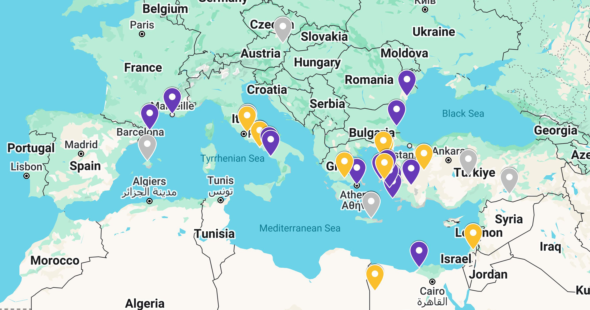

# Context

This document summarizes the state of the research on _art and magic_ carried out during a residency in Civitella di Licenza, Rome, Italy, from September 16, 2024, to January 17, 2025, as part of the [Residency action by Culture Moves Europe](https://culture.ec.europa.eu/creative-europe/creative-europe-culture-strand/culture-moves-europe) program.

# Statement at the Beginning of the First Phase

My artistic research explores the relationship between art and magic, with the Sibyl as a link between Mallorca, Tivoli, and the flows of water (nymphs and naiads). I investigate pre-Hippocratic and shamanic healing figures as well as 'medium' artists such as Hilma af Klint, Leonora Carrington, and Remedios Varo.

My personal practice connects the conceptual with the physical through meditative walks in nature, massage and healing techniques, devotional rituals, and channelling, influenced by traditions such as Cherokee (Tameana). This research is based on a real healing practice.

The work emerging from this process will evoke the healing of the soul, its reflection in the body, the European magical tradition, and its connections with Eastern and American traditions, attempting to prove the hypothesis that this wisdom and power are inherent to all human beings.

---

# Experimentation

On my path, there is one constant: every day, I know less and experiment more. So far, the way to know less has been to learn more — to learn more from the body, mind, intuition, and meditation.

"Everything happens in the body."

## Methodology

- Meditation:
    - Toward dynamic stillness (in biodynamic craniosacral terms).
    - Conversations with trees:
        - Contacting (physically and through the field) in stillness.
        - Formulating questions.
        - Responses come as images.
    - Automatic drawing.
    - Photography (guided by trees, meditative, intuitive).
    - Walking.
- Reading.
- Binary Jumps:
    - Discussions with chatGPT.
    - Interpreting my drawings [2024-10-21 Drawings chatGPT](/posts/chatGPT/2024-10-21/).
    - Code for mapping directions.
    - Statistical analysis of nymph images.
- Integration and Systematization:
    - Organizing notes.
    - Obsidian mental maps.

## Research Map

## The Sibyl

The Sibyl has its dedicated section [here](/docs/sibyl).

## Conversations with Trees

The process for entering meditation and communication with the forest’s life network is explained in [A Small Guide to Talking with Trees](/docs/talking_with_the_trees) and other beings.

[Session details are here](/en/tags/talking-with-trees/).

## The Whisper of the Nymphs (The Small Contains a Universe)

The Whisper of the Nymphs has [its dedicated section here](/docs/sanctuary).

## Binary Jumps

Binary jumps have [their section here](/docs/binary_links).

## Automatic Drawings

Automatic drawings have [their dedicated section here](/docs/drawing).

# Books

## Reading

- _In the Dark Places of Wisdom_, Peter Kingsley
- _Psychomagic_, Alejandro Jodorowsky
- _Voices of Our Ancestors_, Dhyani Ywahoo

## To Read

- _The Physics and Metaphysics of Painting_, Louis Cattiaux
- _Androgyny_, Elémire Zolla
- _Staying with the Trouble: Making Kin in the Chthulucene_, Donna J. Haraway

# Artists

- Hilma af Klint
- Leonora Carrington
- Remedios Varo
- Louis Cattiaux
- Emma Kunz
- Mikalojus Konstantinas Čiurlionis
- Mapi Rivera
- Maria Arnal

Pending: Add new/current ones… check Mapi’s documentation.

# Next Steps

This research is a journey. The residency has meant leaving my job and my home to attempt a new way of life. These first four months in Italy are just the first step. My intention is to continue researching and shaping this process artistically, ritually, as a channel, and as a healer.

## Map

I have gathered all the “clues” on a map. I believe the research must remain in motion. Reading is important, but to understand, I feel I need to walk the places where tradition once lived.

On the [web](https://www.google.com/maps/d/edit?mid=1N9lbW-JlA8tJtXUqbPD6LnPmdEML85I&usp=sharing)

- Yellow points: Temples or possible places of worship or origin of the most famous sibyls.
- Violet points: Places mentioned in _In the Dark Places of Wisdom_.
- Gray points: Locations related to Dionysian worship or intuitively marked as destinations.

> Translated into English by chatGPT