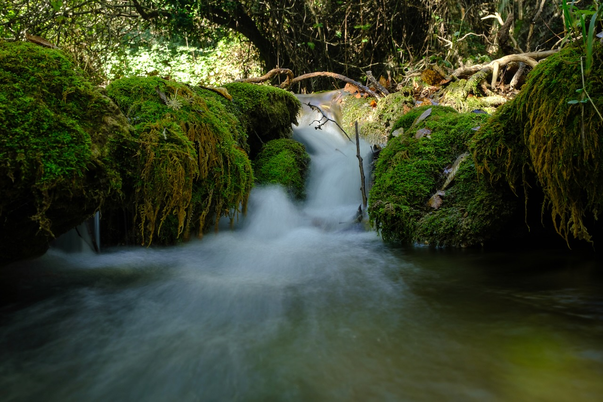
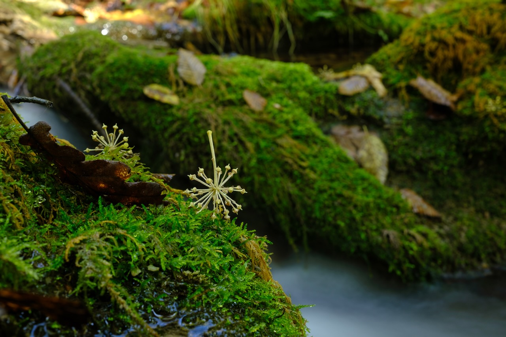
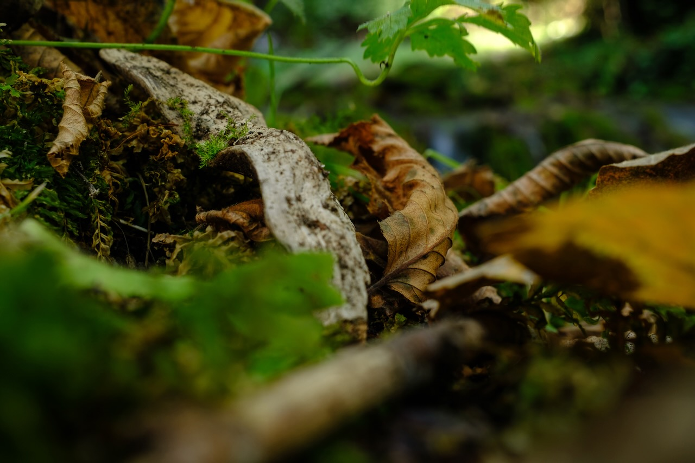
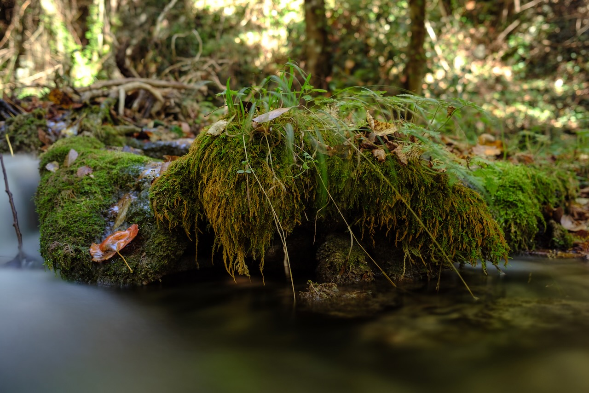
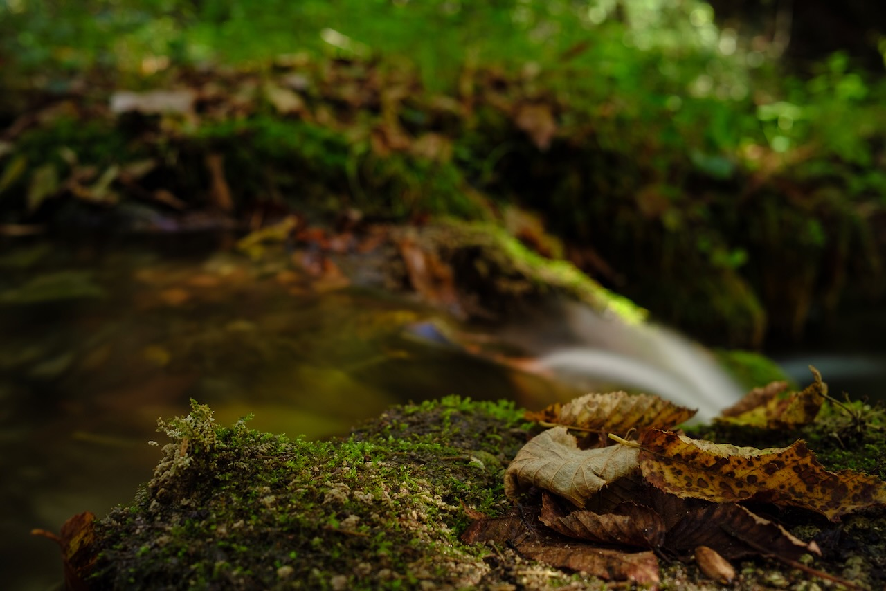
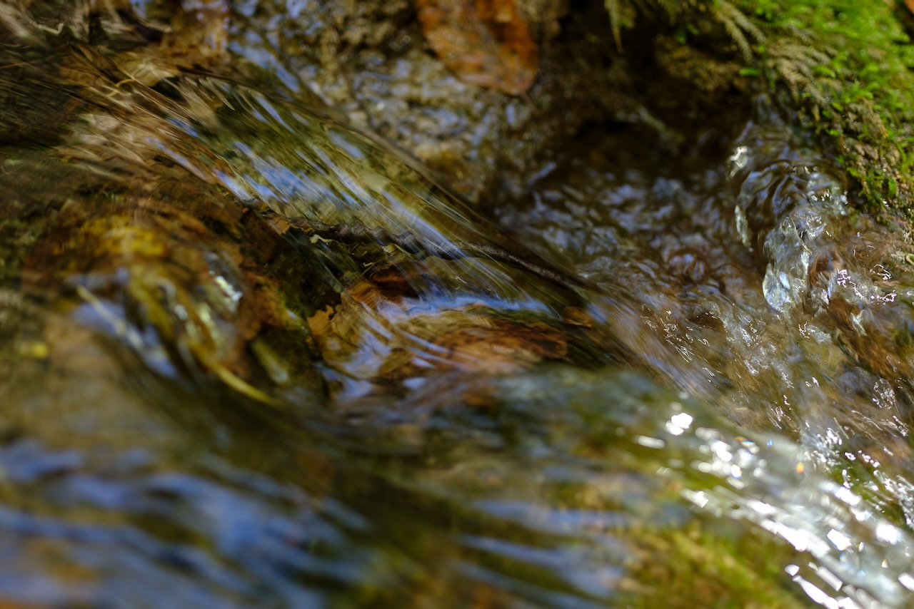
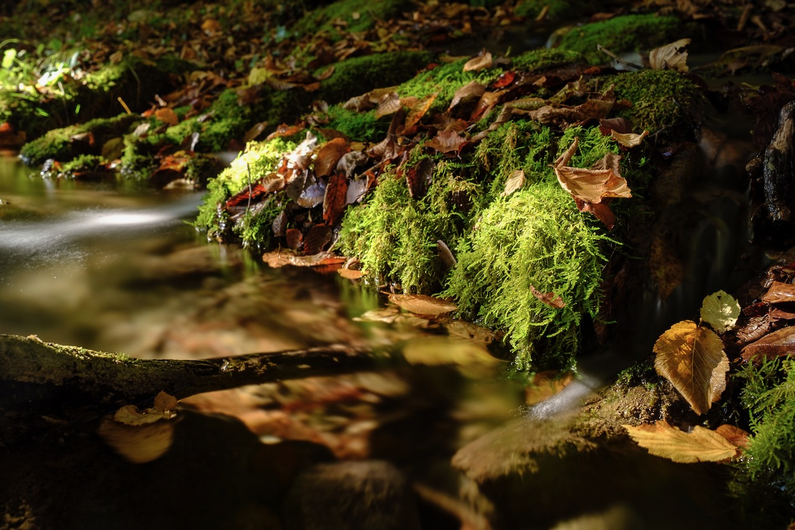
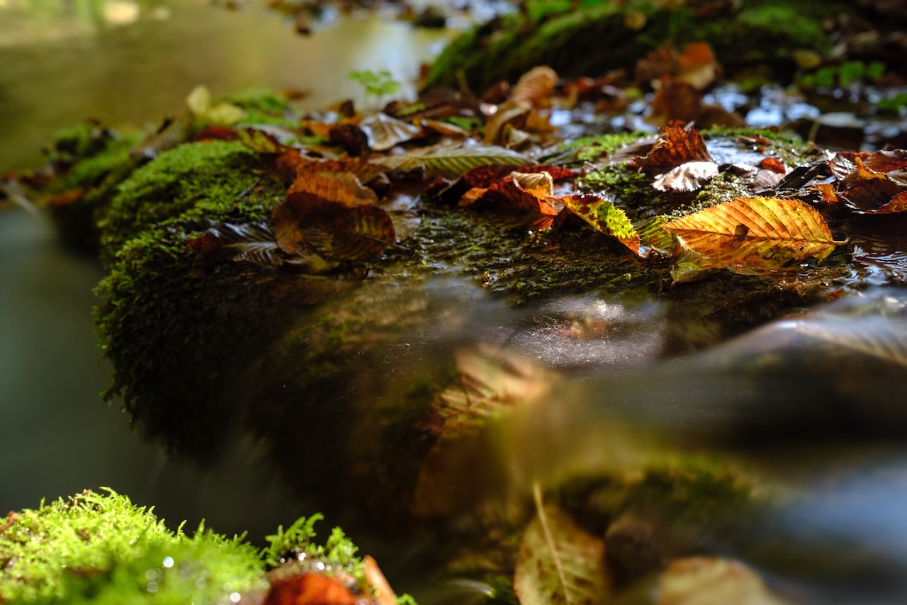
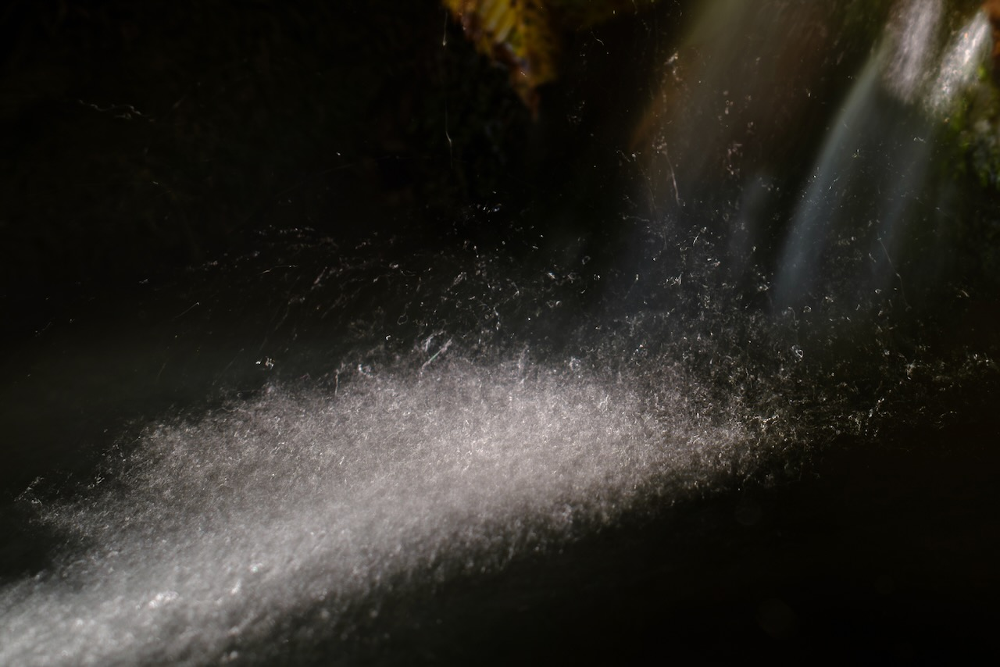
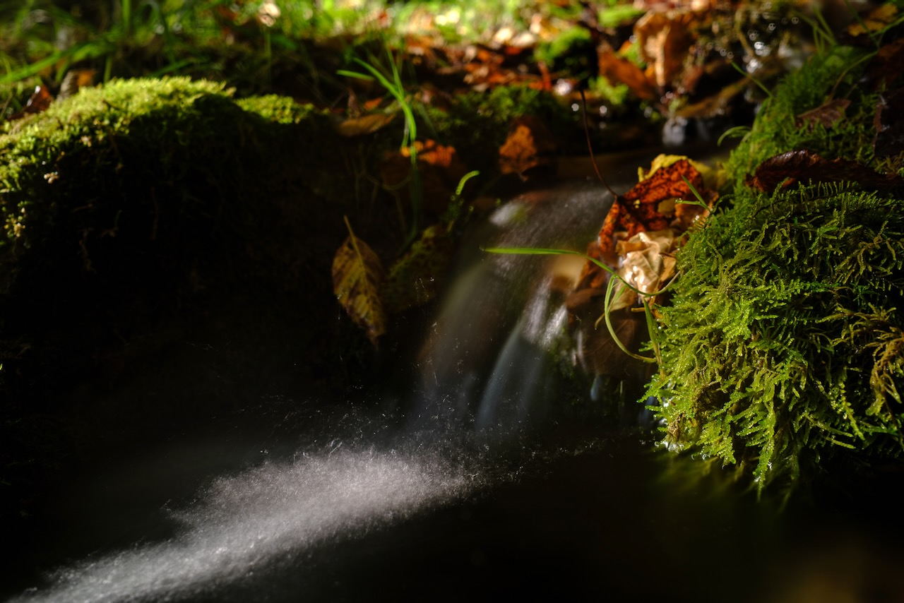

# El Susurro de las Ninfas (lo pequeño contiene un universo)

En las caminatas por el bosque encontré un
lugar: [42°5'29.76" N 12°53'4.56" E](https://www.google.com/maps/place/42%C2%B005'29.8%22N+12%C2%B053'04.6%22E/@42.091604,12.8820251,17z/data=!3m1!4b1!4m4!3m3!8m2!3d42.0916!4d12.8846?entry=ttu&g_ep=EgoyMDI0MTExMy4xIKXMDSoJLDEwMjExMjM0SAFQAw%3D%3D), [un pequeño espacio que no supera los 50 m²](https://www.google.com/maps/d/edit?mid=1RBN4q5D502HuN8aI8RgC7KfpprJPbM0&usp=sharing).
Allí, la luz del sol se filtra tímidamente entre los árboles durante unas pocas horas al día. El
torrente, Fosso Maricella, es apenas un hilo de agua cuyo sonido hipnótico acompaña la quietud del lugar. En este
rincón diminuto, las escalas adquieren otra dimensión: lo pequeño contiene un universo, y el tiempo parece seguir un
ritmo distinto.

El Fosso de Maricella es un afluente del Aniene, que fluye por Tívoli, donde se erige un templo dedicado a la Sibila
Tiburtina. Según la mitología, esta Sibila era una náyade, una ninfa de las aguas dulces que encarnaba la divinidad
del curso que habitaba.

Las fotografías buscan a estas ninfas acuáticas, sus profecías y su entorno. En ellas, los reflejos del sol sobre el
agua en movimiento, capturados con exposiciones prolongadas, revelan trazos y dibujos que imagino como manifestaciones
de las ninfas o de sus mensajes. Esta búsqueda se convierte en un intento de hacer visible lo invisible, de descubrir en
lo efímero las huellas de lo eterno.

El uso de largas exposiciones diluye el tiempo, vuelve tangible el movimiento y desdibuja los límites entre el presente
y el pasado, entre la energía en tránsito y la que permanece suspendida. Estas imágenes no se limitan a registrar el
instante; permiten que el tiempo fluya de una manera distinta, revelando una dimensión más profunda.

Este vínculo entre el agua y el cielo fue aprovechado por los romanos en la construcción de templos, villas y ciudades.
A través de estanques y cursos de agua, simbolizaban la idea de traer "el cielo a la tierra".

Este viaje, entre el cielo y la tierra, es el mismo viaje de las Sibilas entre Apolo y el inframundo de la serpiente
Pitón. Es también el viaje de los iatromantes, los chamanes europeos y americanos, y las sacerdotisas tántricas. Es el
viaje de la muerte antes de la muerte. Todos ellos pueden hacer el viaje, contarlo después y ayudar a otros a
recorrerlo.

El viaje tiene como objetivo entrar en la oscuridad: el lugar donde nace el sol y donde va a descansar. Es el lugar
donde reside todo el conocimiento que espera ser iluminado. Los chamanes van allí a aprender, y la sabiduría que
encuentran tiene el poder de sanar.

# Fotografía

# Video



# Otras imágenes del "santuario"

