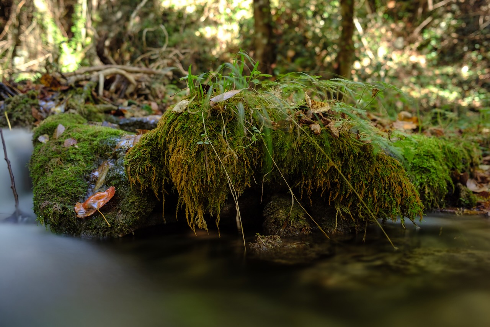
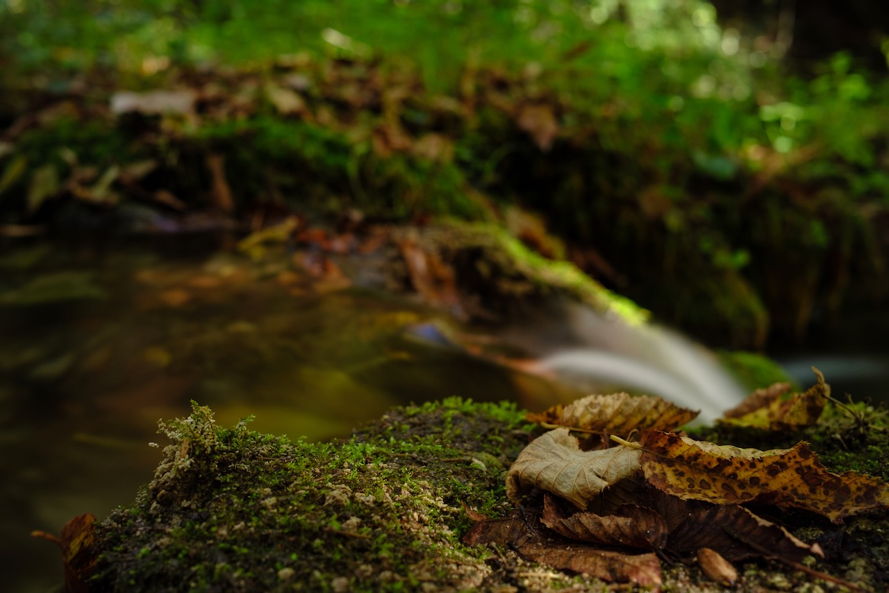
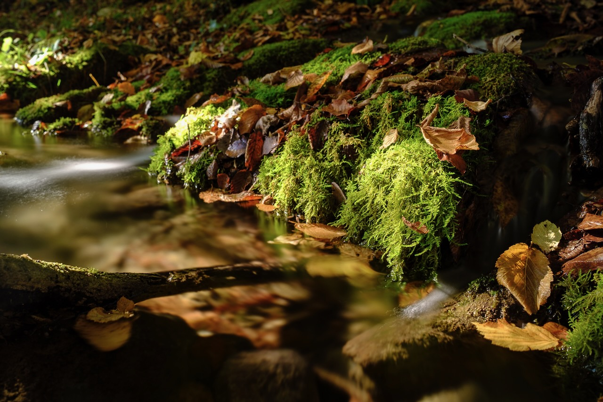

# Il Sussurro delle Ninfe (il piccolo contiene un universo)

Nelle passeggiate nel bosco ho trovato un
luogo: [42°5'29.76" N 12°53'4.56" E](https://www.google.com/maps/place/42%C2%B005'29.8%22N+12%C2%B053'04.6%22E/@42.091604,12.8820251,17z/data=!3m1!4b1!4m4!3m3!8m2!3d42.0916!4d12.8846?entry=ttu&g_ep=EgoyMDI0MTExMy4xIKXMDSoJLDEwMjExMjM0SAFQAw%3D%3D), [un piccolo spazio che non supera i 50 m2](https://www.google.com/maps/d/edit?mid=1RBN4q5D502HuN8aI8RgC7KfpprJPbM0&usp=sharing).
Lì, la luce del sole filtra timidamente tra gli alberi per poche ore al giorno. Il torrente, Fosso Maricella, è appena
un filo d'acqua il cui suono ipnotico accompagna la quiete del luogo. In questo angolo minuscolo, le scale acquisiscono
un'altra dimensione: il piccolo contiene un universo, e il tempo sembra seguire un ritmo diverso.

Il Fosso Maricella è un affluente dell'Aniene, che scorre per Tivoli, dove sorge un tempio dedicato alla Sibilla
Tiburtina. Secondo la mitologia, questa Sibilla era una naiade, una ninfa delle acque dolci che incarnava la divinità
del corso d'acqua in cui abitava.

Le fotografie cercano queste ninfe acquatiche, le loro profezie e il loro ambiente. In esse, i riflessi del sole
sull'acqua in movimento, catturati con lunghe esposizioni, rivelano tratti e disegni che immagino come manifestazioni
delle ninfe o dei loro messaggi. Questa ricerca diventa un tentativo di rendere visibile l'invisibile, di scoprire
nell'effimero le tracce dell'eterno.

L'uso di lunghe esposizioni diluisce il tempo, rende tangibile il movimento e sfuma i confini tra il presente e il
passato, tra l'energia in transito e quella che rimane sospesa. Queste immagini non si limitano a registrare l'istante;
permettono al tempo di fluire in modo diverso, rivelando una dimensione più profonda.

Questo legame tra l'acqua e il cielo è stato sfruttato dai romani nella costruzione di templi, ville e città. Attraverso
stagni e corsi d'acqua, simboleggiavano l'idea di portare "il cielo sulla terra".

Questo viaggio, tra cielo e terra, è lo stesso viaggio delle Sibille tra Apollo e l'oltretomba del serpente Pitone. È
anche il viaggio degli iatromanti, dei sciamani europei e americani, e delle sacerdotesse tantriche. È il viaggio della
morte prima della morte. Tutti loro possono fare il viaggio, raccontarlo dopo e aiutare gli altri a percorrerlo.

Il viaggio ha come obiettivo entrare nell'oscurità: il luogo dove nasce il sole e dove va a riposare. È il luogo dove
risiede tutta la conoscenza che aspetta di essere illuminata. Gli sciamani vanno lì per imparare, e la saggezza che
trovano ha il potere di guarire.

# Fotografia

# Video



# Oltre immagini del "santuario"

