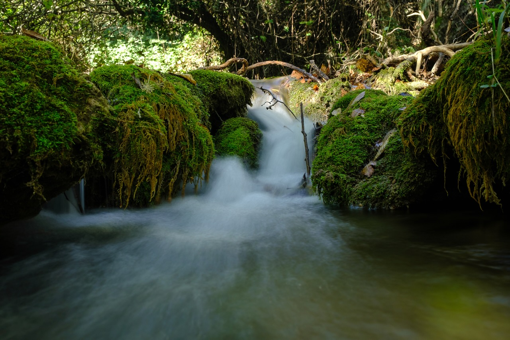
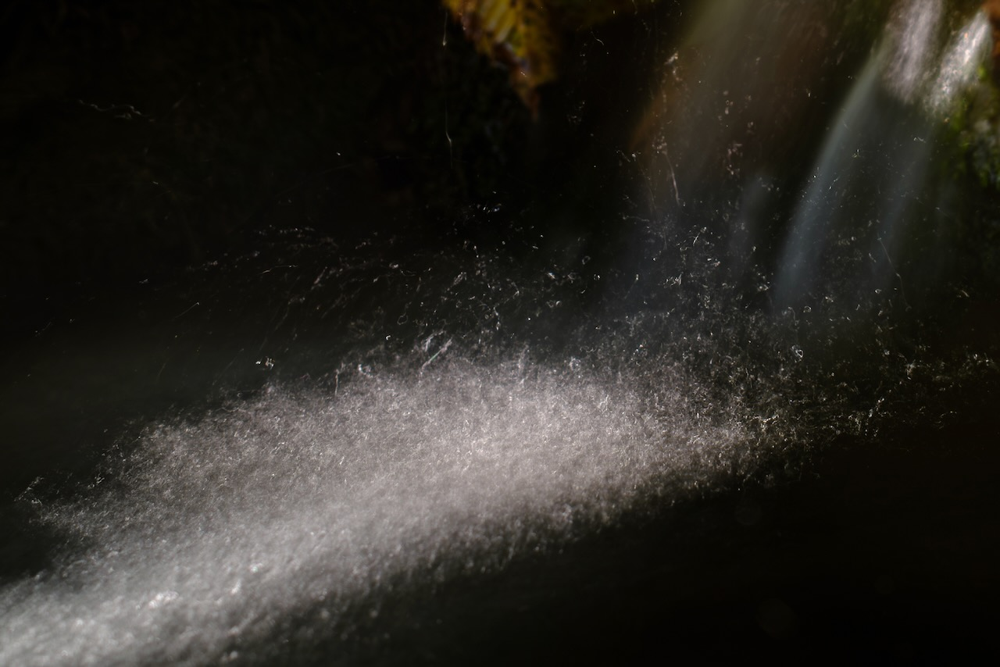

# The Whisper of the Nymphs (the small contains a universe)

During my walks through the forest, I found a [place](https://www.google.com/maps/place/42%C2%B005'29.8%22N+12%C2%B053'04.6%22E/@42.091604,12.8820251,17z/data=!3m1!4b1!4m4!3m3!8m2!3d42.0916!4d12.8846?entry=ttu&g_ep=EgoyMDI0MTExMy4xIKXMDSoJLDEwMjExMjM0SAFQAw%3D%3D): [42°5'29.76" N 12°53'4.56" E](https://www.google.com/maps/d/edit?mid=1RBN4q5D502HuN8aI8RgC7KfpprJPbM0&usp=sharing), [a tiny spot measuring less than 50 m²](https://www.google.com/maps/d/edit?mid=1RBN4q5D502HuN8aI8RgC7KfpprJPbM0&usp=sharing).  
Here, sunlight timidly filters through the trees for just a few hours each day. The Fosso Maricella stream is barely a trickle of water, whose hypnotic sound accompanies the stillness of the place. In this small corner, scale takes on a new meaning: the small contains a universe, and time seems to follow a different rhythm.

The Fosso Maricella is a tributary of the Aniene, which flows through Tivoli, where a temple dedicated to the Tiburtine Sibyl stands. According to mythology, this Sibyl was a naiad, a freshwater nymph embodying the divinity of the stream she inhabited.

The photographs search for these aquatic nymphs, their prophecies, and their surroundings. In them, the reflections of sunlight on moving water, captured through long exposures, reveal traces and drawings I imagine as manifestations of the nymphs or their messages. This pursuit becomes an attempt to make the invisible visible, to discover in the ephemeral the imprints of the eternal.

The use of long exposures dissolves time, renders motion tangible, and blurs the boundaries between present and past, between energy in transit and energy suspended. These images do more than record a moment; they allow time to flow differently, unveiling a deeper dimension.

This link between water and sky was harnessed by the Romans in the construction of temples, villas, and cities. Through ponds and streams, they symbolized the idea of bringing "heaven to earth."

This journey between heaven and earth mirrors the Sibyls’ journey between Apollo and the underworld serpent Python. It is also the journey of the iatromantes, European and American shamans, and tantric priestesses. It is the journey of death before death. All of them embark on this journey, recount it, and help others traverse it.

The journey aims to enter the darkness: the place where the sun is born and where it goes to rest. It is where all knowledge resides, waiting to be illuminated. Shamans venture there to learn, and the wisdom they find has the power to heal.

## Photography

## Video



## Other images from the "sanctuary"

