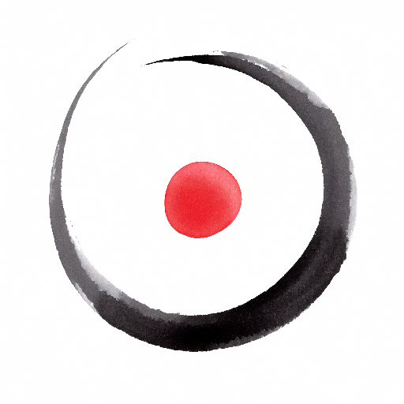
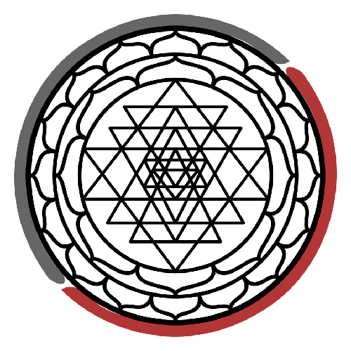

The vision during the first conversation with the tree was of a woman lying in bed in intimacy, without a face.  
The gaze focuses on the navel. I connected this to the Omphalos as a navel and represented by a circle with a dot inside.  
That day, I later linked it to the Monad, Pau, and Ilaria.

On November 13, I also saw the connection with my signatures and logos. Both signatures have a main circle with a dot outside at the bottom right. The logos already include the dot at the center.

Note: [Pau Lluc](https://pau-lluc.xyz/) is my pseudonym as a massage therapist.

| Fran Simó - Legal | Fran Simó - Wanderer | Pau Lluc         | Unity Labs                  |
| ------------------ | -------------------- | ---------------- | --------------------------- |
|   |     |  |  |
