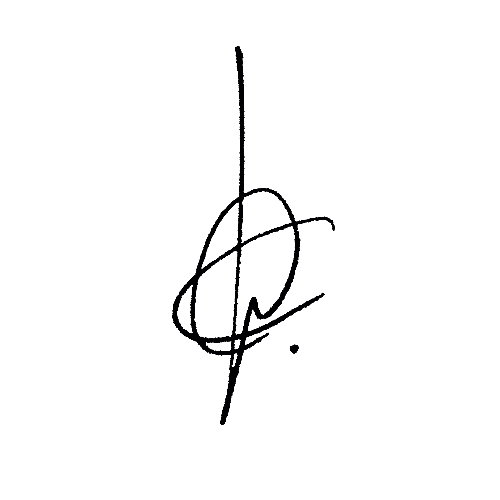
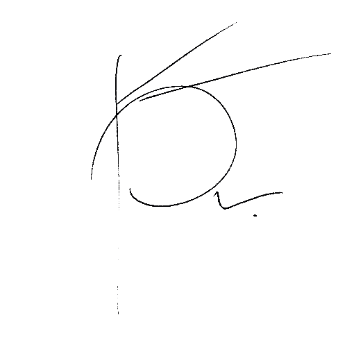
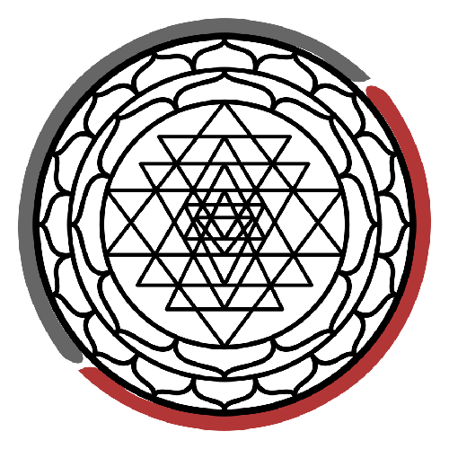

La visión en la primera conversación con el árbol fue una mujer en la cama en intimidad, sin rostro. 
La mirada se enfoca al ombligo. Lo vinculé con el Ónfalo como obligo y representado con un círculo con un punto dentro. 
Ese día, más tarde lo relacioné con la Monada, Pau e Ilaria.

El 13 de noviembre veo también la relación con mis firmas y mis logos. Ambas firmas tienen un círculo principal y un punto en el exterior abajo a la derecha. Los logos ya llevan el punto en el centro.

Nota: [Pau Lluc](https://pau-lluc.xyz/) es mi seudónimo de masajista.

| Fran Simó - Legal | Fran Simó - vagabundo | Pau Lluc         | Unity Labs                  |
| ----------------- | --------------------- | ---------------- | --------------------------- |
|  |      |  |  |

